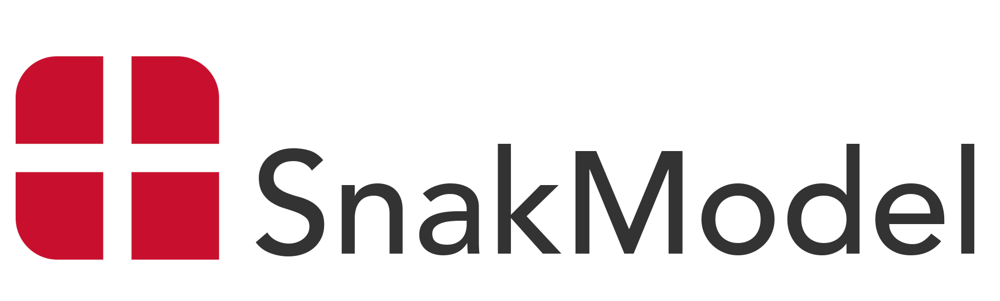

**SnakModel** is a 7B-parameter, autoregressive language model specifically designed for Danish. There are both an instruction-tuned variant, as well as a base version for further fine-tuning. Our models build upon [Llama 2](https://huggingface.co/meta-llama/Llama-2-7b-hf), which we continuously pre-train on a diverse collection of Danish corpora comprising 350M documents and 13.6B words, before tuning it on 3.7M Danish instruction-answer pairs.

**Developers**

[**🧭 NLPnorth** research unit](https://nlpnorth.github.io) at the [IT University of Copenhagen](https://itu.dk), Denmark.

## Resources

* 💬 SnakModeller:
  * **[SnakModel-7B (base)](https://huggingface.co/NLPnorth/snakmodel-7b-base)**: The base LM trained on Danish text completion + its intermediate checkpoints.
  * **[SnakModel-7B (instruct)](https://huggingface.co/NLPnorth/snakmodel-7b-instruct)**: An instruction-tuned variant of the base model + its intermediate checkpoints.
* ⚙️ Model Training Dynamics:
  * **Research Paper**: coming in Q1 2025.
  * **Codebase**: coming soon to this repository.
* 🇩🇰 Cultural Awareness Evaluation:
  * **Research Paper**: coming in Q1 2025 (pre-print coming soon).
  * **Codebase**: coming soon to this repository.
  * **Web-based LLM Evaluation Interface**: coming soon.
